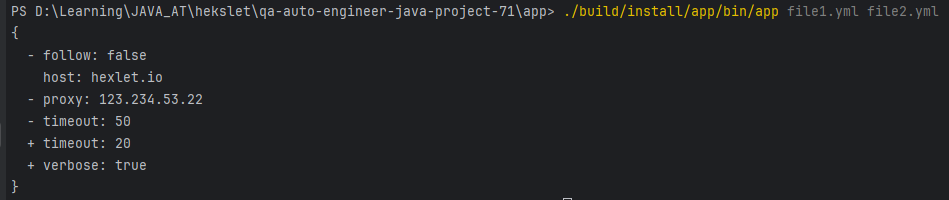

### Hexlet tests and linter status:
[](https://github.com/2DimBer3/qa-auto-engineer-java-project-71/actions)

### Sonar badges

[](https://sonarcloud.io/summary/new_code?id=2DimBer3_qa-auto-engineer-java-project-71)
[](https://sonarcloud.io/summary/new_code?id=2DimBer3_qa-auto-engineer-java-project-71)
[](https://sonarcloud.io/summary/new_code?id=2DimBer3_qa-auto-engineer-java-project-71)
[](https://sonarcloud.io/summary/new_code?id=2DimBer3_qa-auto-engineer-java-project-71)
[](https://sonarcloud.io/summary/new_code?id=2DimBer3_qa-auto-engineer-java-project-71)
[](https://sonarcloud.io/summary/new_code?id=2DimBer3_qa-auto-engineer-java-project-71)
[](https://sonarcloud.io/summary/new_code?id=2DimBer3_qa-auto-engineer-java-project-71)
[](https://sonarcloud.io/summary/new_code?id=2DimBer3_qa-auto-engineer-java-project-71)
[](https://sonarcloud.io/summary/new_code?id=2DimBer3_qa-auto-engineer-java-project-71)
[](https://sonarcloud.io/summary/new_code?id=2DimBer3_qa-auto-engineer-java-project-71)
[](https://sonarcloud.io/summary/new_code?id=2DimBer3_qa-auto-engineer-java-project-71)

### Пример работы программы

#### Сравнение JSON-файлов

<u>file1.json</u>
```json
{
  "host": "hexlet.io",
  "timeout": 50,
  "proxy": "123.234.53.22",
  "follow": false
}
```

<u>**file2.json**</u>
```json
{
  "timeout": 20,
  "verbose": true,
  "host": "hexlet.io"
}
```

<u>Результат выполнения программы:</u>


#### Сравнение YAML-файлов

<u>file1.yml</u>
```yaml
host: hexlet.io
timeout: 50
proxy: 123.234.53.22
follow: false
```

<u>file2.yaml</u>
```yaml
timeout: 20
verbose: true
host: hexlet.io
```

<u>Результат выполнения программы:</u>


